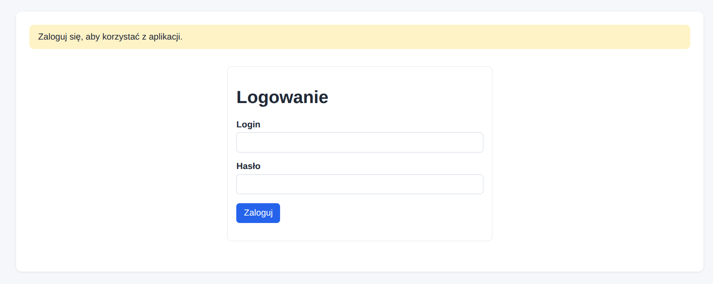
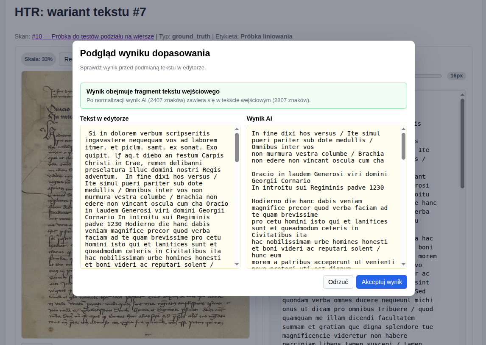
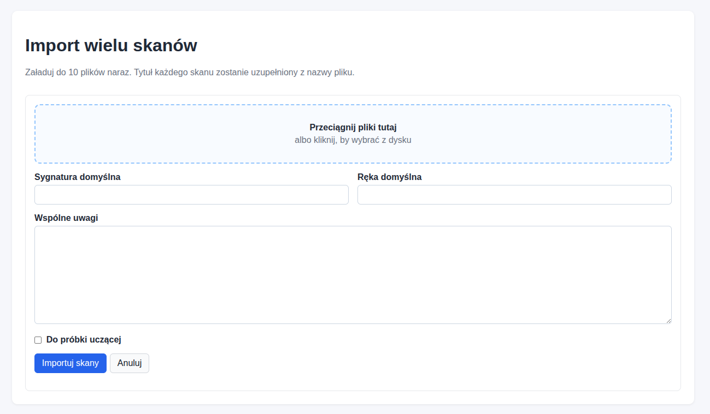

# Manuscripts Lab 

Prototyp aplikacji do pracy ze skanami manuskryptów (HTR) oraz tłumaczeniem dokumentów.

### Moduł „Skany”
- dodawanie i edycja definicji skanów,
- upload obrazu skanu, także serii skanów
- dodawanie tekstów typu `ground_truth` i `model_output`,
- porównanie dwóch wariantów tekstu dla skanu + obliczanie CER i WER,

### Moduł „Dokumenty”
- dodawanie i edycja dokumentów,
- wiązanie dokumentu ze skanami,
- przechowywanie tekstu źródłowego
- dodawanie wariantów tłumaczenia, w tym tłumaczenia referencyjnego i tłumaczeń wykonanych automatycznie narzędziem np. modelem językowym,
- porównanie dwóch wariantów tłumaczenia + obliczanie metryk BLEU i chrF.

## Wymagania
- Python 3.11+
- SQLite

## Zrzuty ekranu









## Instalacja

```bash
python -m venv .venv
source .venv/bin/activate
pip install -r requirements.txt
```

## Uruchomienie

```bash
flask --app run.py shell
```

Utworzenie bazy:

```bash
flask --app run.py db init
flask --app run.py db migrate -m "init"
flask --app run.py db upgrade
```

Start aplikacji:

```bash
python run.py
```

Praca produkcyjna (`nginx` + `gunicorn`):

```bash
export SECRET_KEY="zmien-to-na-losowy-sekret"
gunicorn -w 2 -b 127.0.0.1:8000 "run:app"
```

Uwagi wdrożeniowe:
- dla SQLite aplikacja ustawia `WAL` i `busy_timeout`, co pomaga przy małej liczbie równoczesnych zapisów,
- przy równoczesnej edycji tego samego rekordu druga osoba dostanie komunikat o konflikcie zamiast cichego nadpisania,
- przy pracy w sieci należy ustawić własny `SECRET_KEY`.

Logowanie użytkowników:

```bash
flask --app run.py create-user
```

Jednorazowe wygenerowanie miniaturek dla już istniejących skanów:

```bash
flask --app run.py generate-scan-thumbnails
```

Jeśli chcesz przegenerować je wszystkie od nowa:

```bash
flask --app run.py generate-scan-thumbnails --force
```

Po utworzeniu pierwszego użytkownika logowanie jest dostępne pod `/auth/login`, a pozostałe widoki wymagają zalogowania.

Automatyczne dopasowanie linii w workspace HTR wymaga klucza API do modelu Gemini (domyślnie używany jest Gemini Pro 3.1 Preview):

```bash
GEMINI_API_KEY=twoj-klucz-api
```

Opcjonalnie można też ustawić inny model (inny wariant Gemini):

```bash
GEMINI_ALIGNMENT_MODEL=gemini-3-flash-preview
```

Po ustawieniu klucza w widoku `HTR` dla wariantu tekstu pojawia się przycisk `Dopasuj linie przez AI`, który pobiera obraz skanu i bieżący tekst z edytora, wysyła je do modelu Gemini i wstawia wynik z podziałem na wiersze z powrotem do pola edycji.

Przykładowe pliki wdrożeniowe:
- `deploy/manuscript-lab.service` - usługa `systemd` dla `gunicorn`,
- `deploy/manuscript-lab.nginx.conf` - przykładowy vhost `nginx`.
- `deploy/backup.sh` - prosty backup SQLite, uploadów i `.env`.

Aplikacja może działać pod prefiksem reverse proxy, np. `/manuscriptlab/`. W takim wariancie `nginx` powinien przekazywać:

```nginx
proxy_set_header X-Forwarded-Prefix /manuscriptlab;
```

Przykładowe wdrożenie na serwerze:

```bash
sudo cp deploy/manuscript-lab.service /etc/systemd/system/manuscript-lab.service
sudo cp deploy/manuscript-lab.nginx.conf /etc/nginx/sites-available/manuscript-lab
sudo ln -s /etc/nginx/sites-available/manuscript-lab /etc/nginx/sites-enabled/manuscript-lab
sudo systemctl daemon-reload
sudo systemctl enable --now manuscript-lab
sudo nginx -t
sudo systemctl reload nginx
```

Przed użyciem należy dostosować:
- `User`, `Group`, `WorkingDirectory`, `PATH` i `ExecStart` w `deploy/manuscript-lab.service`,
- prefiks URL, `server_name` oraz ścieżki `alias` w `deploy/manuscript-lab.nginx.conf`,
- wartość `SECRET_KEY` w usłudze `systemd`.

## Backup

Najprostszy backup dla tej aplikacji obejmuje:
- bazę SQLite `instance/app.db`.

Domyślnie skrypt robi kopię tylko bazy danych. To zalecane ustawienie, jeśli pliki skanów są duże i rzadko się zmieniają.

Gotowy skrypt dostępny jest w folderze deploy:

```bash
chmod +x deploy/backup.sh
./deploy/backup.sh
```

Domyślnie backupy trafiają do katalogu `backups/` w katalogu projektu i starsze niż 14 dni są usuwane. Można to modyfikować przez zmienne środowiskowe:

```bash
BACKUP_DIR=/srv/manuscript-lab-backups RETENTION_DAYS=30 ./deploy/backup.sh
```

Jeśli chcesz jednorazowo dołączyć uploady lub `.env`, możesz to włączyć jawnie:

```bash
INCLUDE_UPLOADS=1 INCLUDE_ENV=1 ./deploy/backup.sh
```

Przykład wpisu do `crontab`, uruchamiany codziennie o 02:15:

```cron
15 2 * * * cd /sciezka/do/manuscript-lab && /bin/bash ./deploy/backup.sh >> /var/log/manuscript-lab-backup.log 2>&1
```

Podgląd i edycja `cron`:

```bash
crontab -e
```

## Struktura folderów i plików

```text
app/
  blueprints/
  models/
  services/
  templates/
  static/
instance/
  uploads/scans/
run.py
requirements.txt
README.md
```

## Uwagi
- obrazy skanów są zapisywane na dysku w `instance/uploads/scans/`,
- baza SQLite - jest wystarczająca dla prototypu i małego zespołu, dla dużego projektu można pomyśleć o zmianie na np. PostgreSQL.
