# Manuscripts Lab 

Prototyp aplikacji do pracy ze skanami manuskryptów (HTR) oraz tłumaczeniem dokumentów.

### Moduł „Skany”
- dodawanie i edycja definicji skanów,
- upload obrazu skanu,
- dodawanie tekstów typu `ground_truth` i `model_output`,
- porównanie dwóch wariantów tekstu dla skanu,
- obliczanie CER i WER,
- generowanie prostego diff dla wariantów tekstów z HTR.

### Moduł „Dokumenty”
- dodawanie i edycja dokumentów,
- wiązanie dokumentu ze skanami,
- przechowywanie tekstu źródłowego i tłumaczenia referencyjnego,
- dodawanie wariantów tłumaczenia,
- porównanie dwóch wariantów tłumaczenia,
- obliczanie BLEU i chrF.

## Wymagania
- Python 3.11+
- SQLite

## Zrzuty ekranu

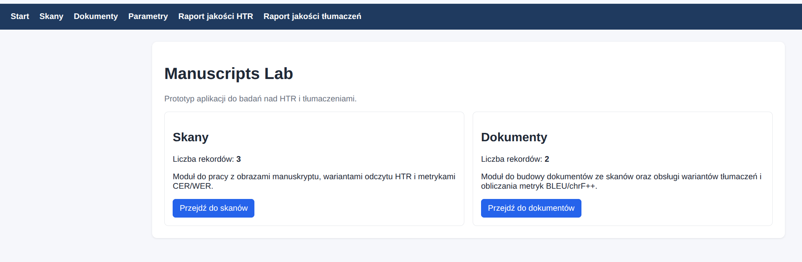

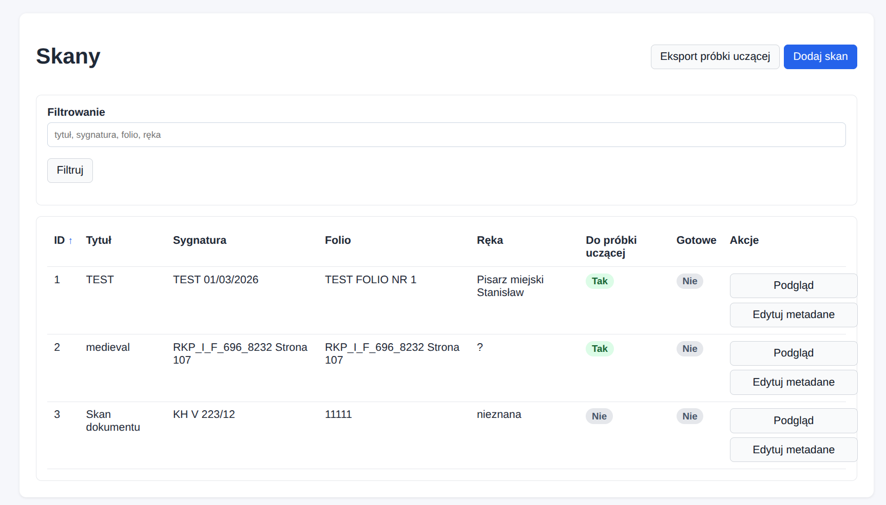

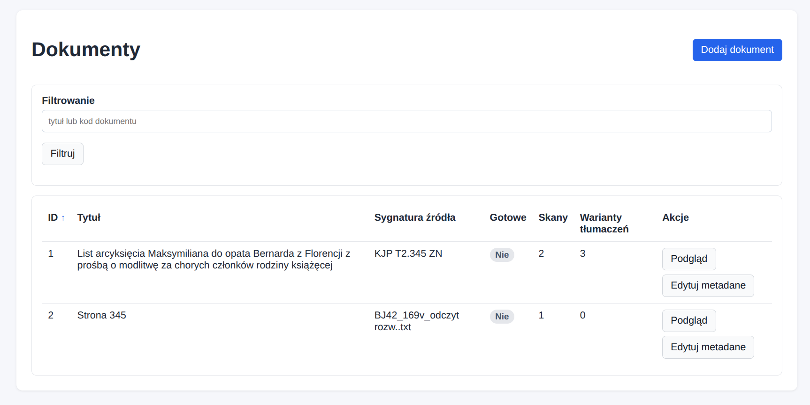

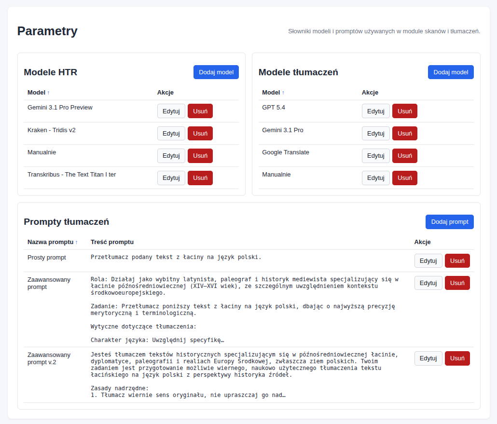

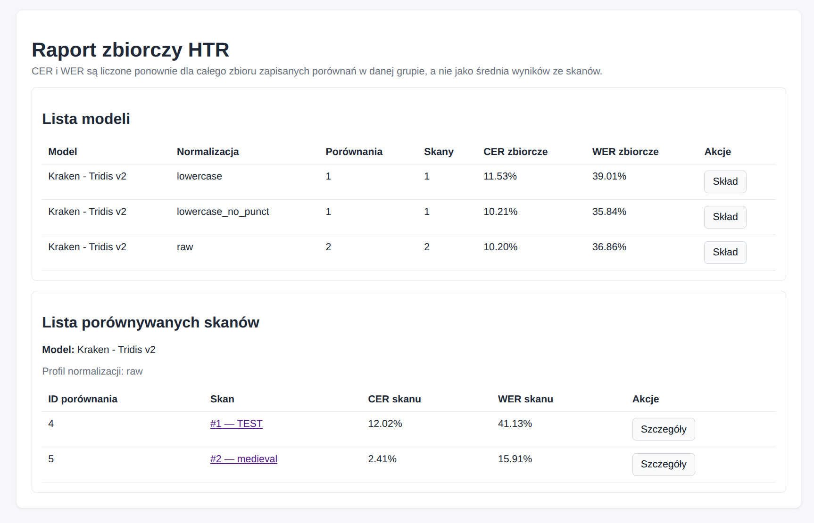

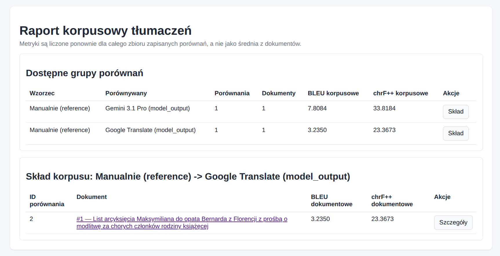

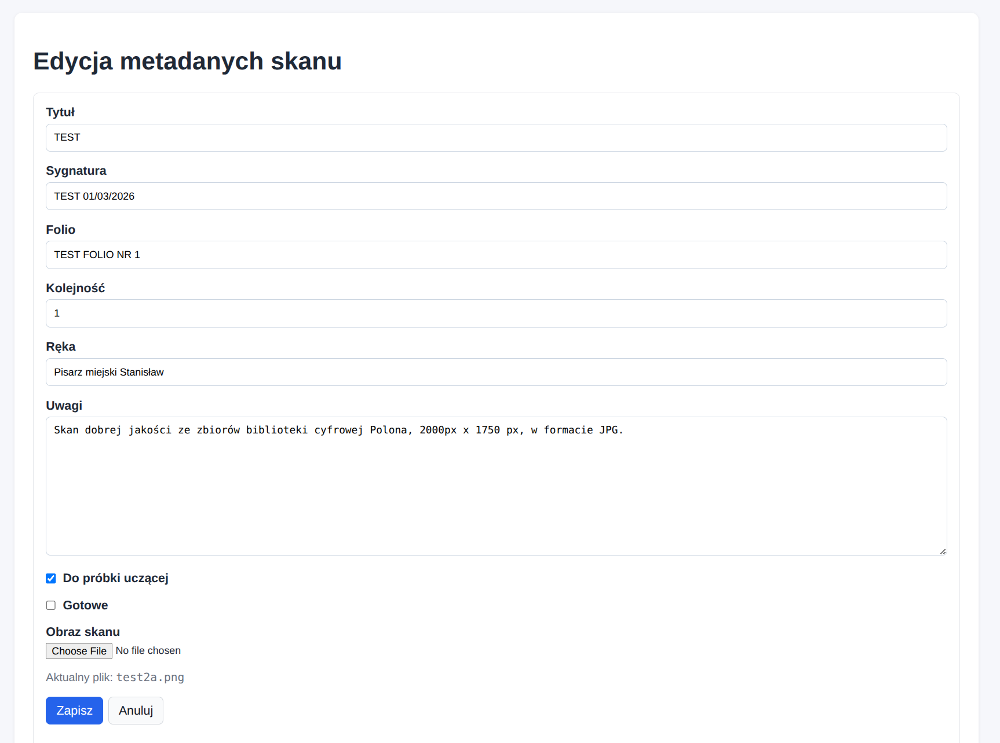

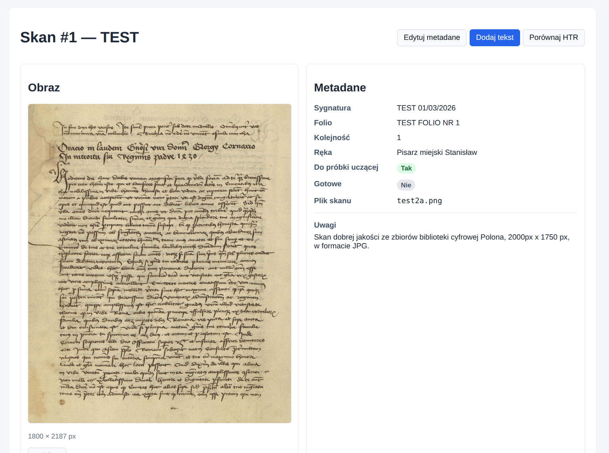

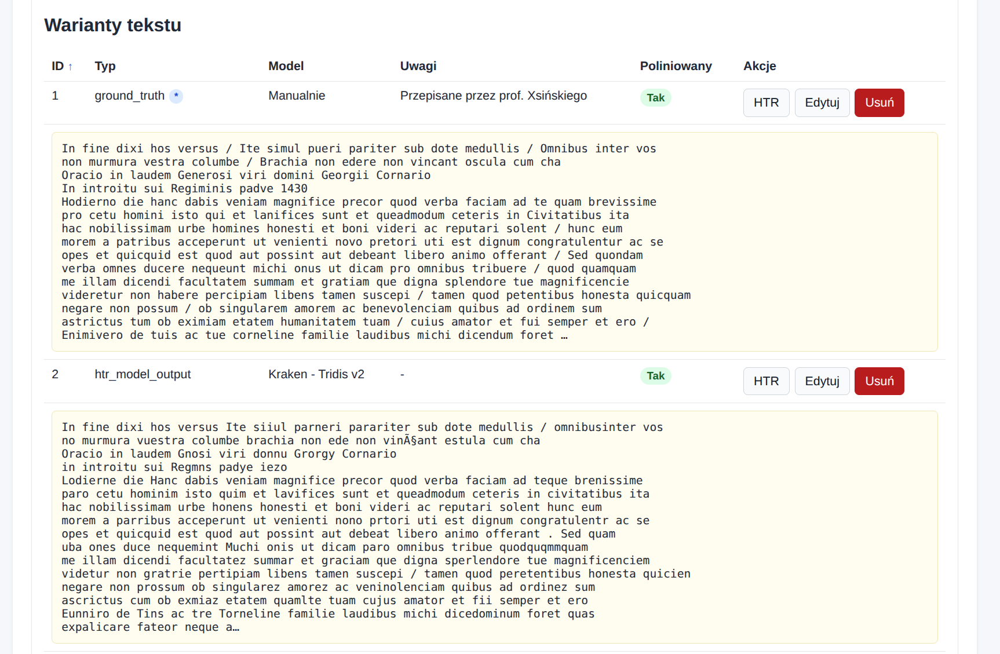

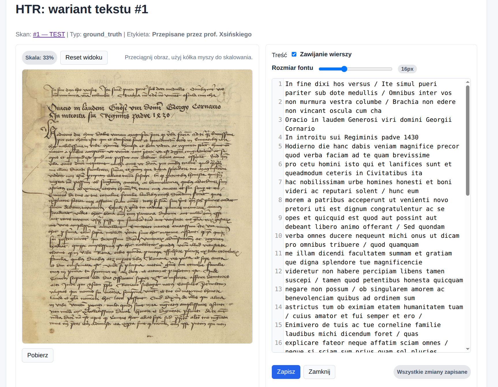

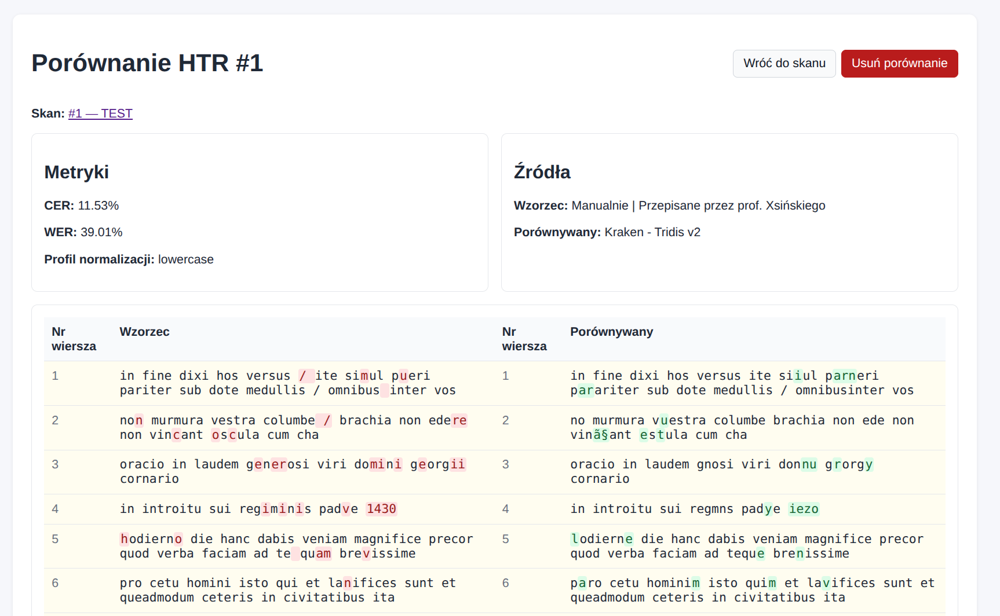

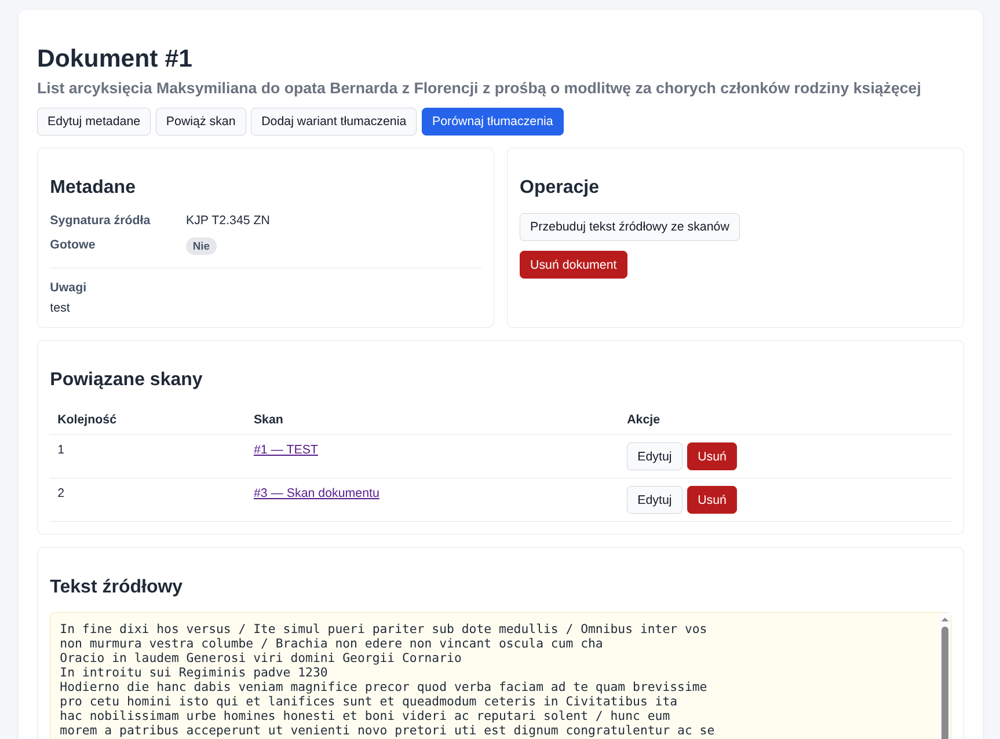

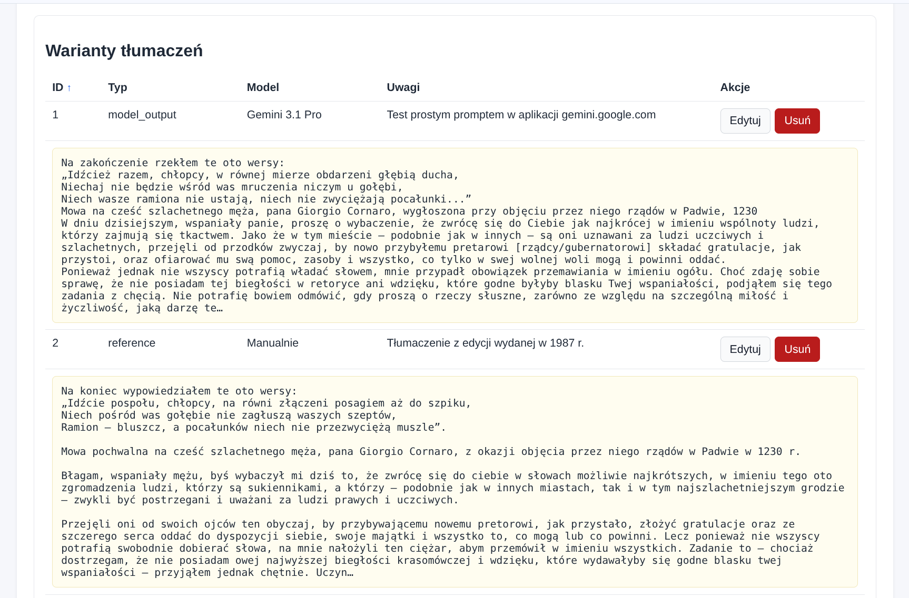

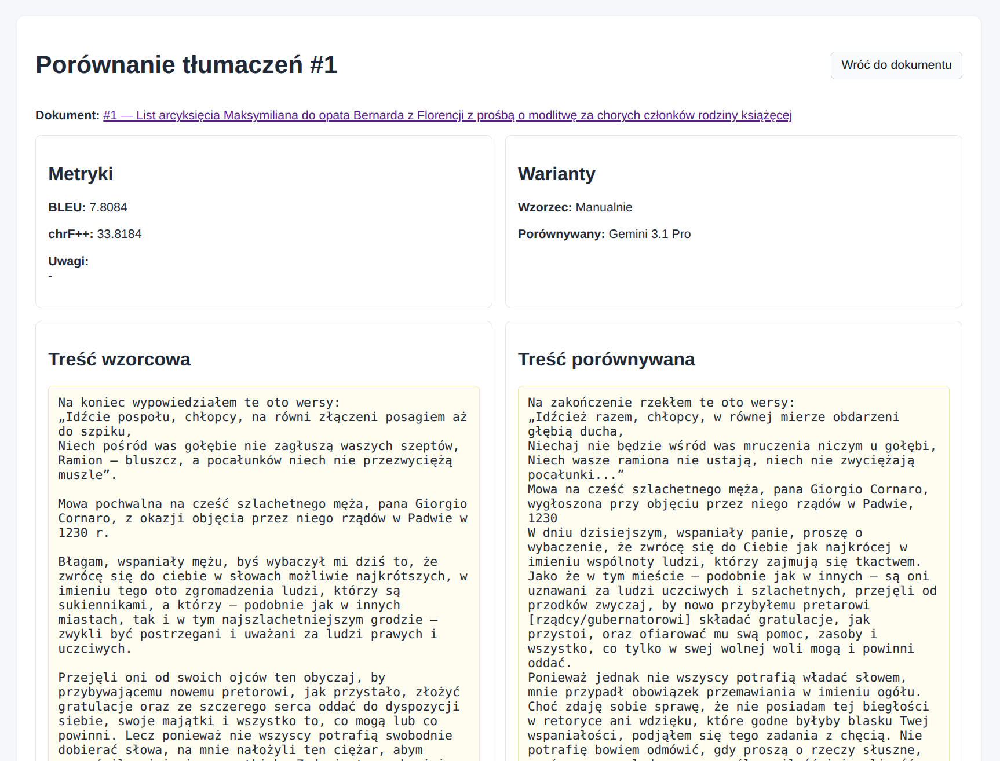

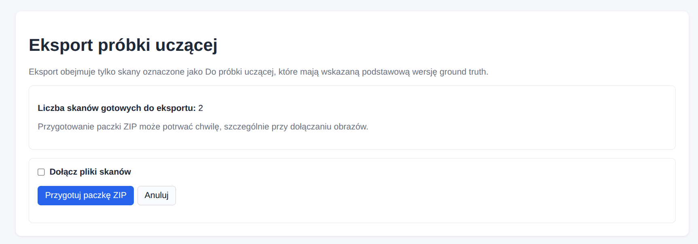

## Instalacja

```bash
python -m venv .venv
source .venv/bin/activate
pip install -r requirements.txt
```

## Uruchomienie

```bash
flask --app run.py shell
```

Utworzenie bazy:

```bash
flask --app run.py db init
flask --app run.py db migrate -m "init"
flask --app run.py db upgrade
```

Start aplikacji:

```bash
python run.py
```

Praca produkcyjna (`nginx` + `gunicorn`):

```bash
export SECRET_KEY="zmien-to-na-losowy-sekret"
gunicorn -w 2 -b 127.0.0.1:8000 "run:app"
```

Uwagi wdrożeniowe:
- dla SQLite aplikacja ustawia `WAL` i `busy_timeout`, co pomaga przy małej liczbie równoczesnych zapisów,
- przy równoczesnej edycji tego samego rekordu druga osoba dostanie komunikat o konflikcie zamiast cichego nadpisania,
- przy pracy w sieci należy ustawić własny `SECRET_KEY`.

Logowanie użytkowników:

```bash
flask --app run.py create-user
```

Po utworzeniu pierwszego użytkownika logowanie jest dostępne pod `/auth/login`, a pozostałe widoki wymagają zalogowania.

Przykładowe pliki wdrożeniowe:
- `deploy/manuscript-lab.service` - usługa `systemd` dla `gunicorn`,
- `deploy/manuscript-lab.nginx.conf` - przykładowy vhost `nginx`.

Przykładowe wdrożenie na serwerze:

```bash
sudo cp deploy/manuscript-lab.service /etc/systemd/system/manuscript-lab.service
sudo cp deploy/manuscript-lab.nginx.conf /etc/nginx/sites-available/manuscript-lab
sudo ln -s /etc/nginx/sites-available/manuscript-lab /etc/nginx/sites-enabled/manuscript-lab
sudo systemctl daemon-reload
sudo systemctl enable --now manuscript-lab
sudo nginx -t
sudo systemctl reload nginx
```

Przed użyciem należy dostosować:
- `User`, `Group`, `WorkingDirectory`, `PATH` i `ExecStart` w `deploy/manuscript-lab.service`,
- `server_name` oraz ścieżki `alias` w `deploy/manuscript-lab.nginx.conf`,
- wartość `SECRET_KEY` w usłudze `systemd`.

## Struktura folderów i plików

```text
app/
  blueprints/
  models/
  services/
  templates/
  static/
instance/
  uploads/scans/
run.py
requirements.txt
README.md
```

## Uwagi
- obrazy skanów są zapisywane na dysku w `instance/uploads/scans/`,
- baza SQLite - wystarczająca dla prototypu i małego zespołu
